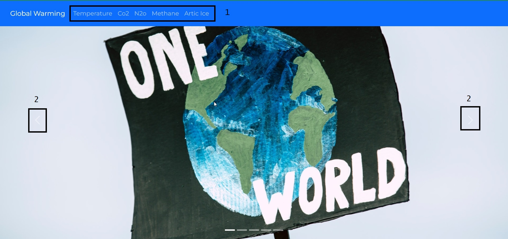
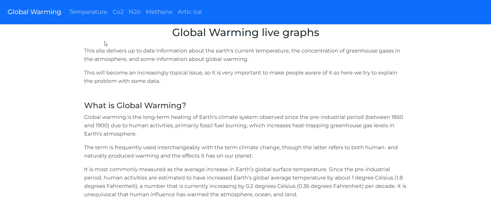
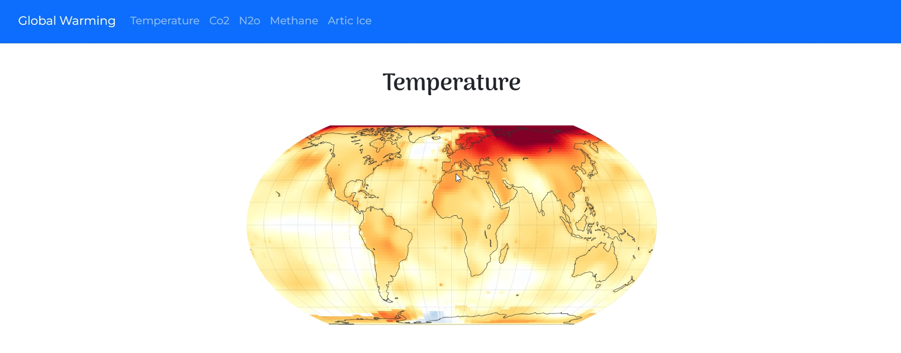
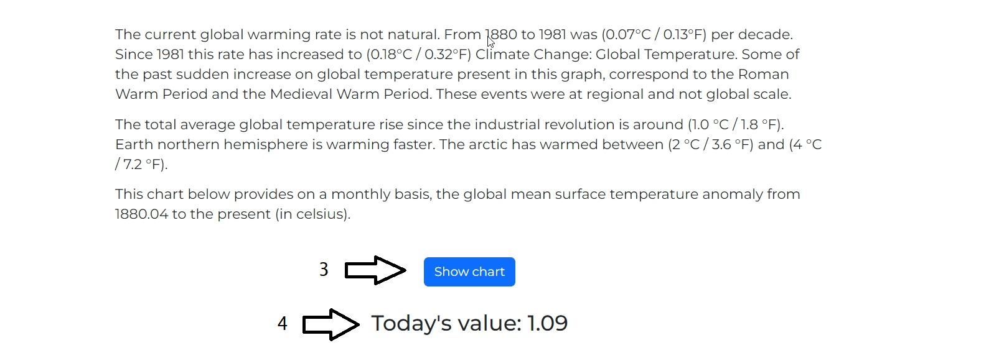
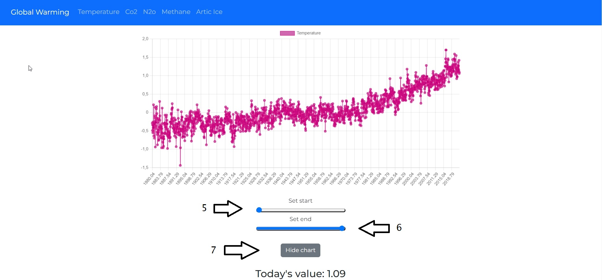

## Global Warming Project

## Description

This project give us some data about climate changing , in specific about Temperature, cO2 , N2O, Methane and Ice melt.
The data are from API https://global-warming.org/

## Link Applicazione

## Home Page

In the Home Page there is an automatic Carousel with some images , with the arrows it's possible to change(2).
In the nav bar you can choose between pages "temperature", "cO2", "N2o", "Methane" and "Artic Ice" situation

## Home description

In the same page below the carousel there are some general informations about global warming.

## Page

If you open up on of the pages in the nav bar you go in the relative page.

## Show Chart

In the same page beelow you can open up the relative chart(3) and see Today's value.

## Chart

After opening the graph, you can see its trend and choose a time range with the appropriate selectors(5)(6).
With the hide chart button you can also close it(7).

## Built with

- [React](https://it.reactjs.org/)
- [Axios](https://github.com/axios/axios)
- [React Chartjs-2](https://www.chartjs.org/docs/latest/)
- [React Bootstrap](https://react-bootstrap.github.io/)
- [React Router](https://www.w3schools.com/react/react_router.asp)
- [React Hooks](https://reactjs.org/docs/hooks-intro.html)
- [SASS](https://sass-lang.com/)

## API Reference

| Documentation      | Link                                |
| :----------------- | :---------------------------------- |
| Global Warning API | [Home](https://global-warming.org/) |

## Links

# Acknowledgements

- [Awesome Readme Templates](https://awesomeopensource.com/project/elangosundar/awesome-README-templates)
- [Awesome README](https://github.com/matiassingers/awesome-readme)
- [How to write a Good readme](https://bulldogjob.com/news/449-how-to-write-a-good-readme-for-your-github-project)
- [Webpack Tutorial: how to set up webpack 5 from scratch](https://www.taniarascia.com/how-to-use-webpack)

# Getting Started with my project

If you want to download the project locally and check that it works correctly, you need to do a series of steps.

Clone the project with your code in your code editor.

### `$git clone https://github.com/eliasanta/global-warming-project-final.git`

Install project's dependecies with:

### `npm install`

Run the app in the development mode with this command:

### `npm start`

# Getting Started with Create React App

This project was bootstrapped with [Create React App](https://github.com/facebook/create-react-app).

## Available Scripts

In the project directory, you can run:

### `npm start`

Runs the app in the development mode.\
Open [http://localhost:3000](http://localhost:3000) to view it in your browser.

The page will reload when you make changes.\
You may also see any lint errors in the console.

### `npm test`

Launches the test runner in the interactive watch mode.\
See the section about [running tests](https://facebook.github.io/create-react-app/docs/running-tests) for more information.

### `npm run build`

Builds the app for production to the `build` folder.\
It correctly bundles React in production mode and optimizes the build for the best performance.

The build is minified and the filenames include the hashes.\
Your app is ready to be deployed!

See the section about [deployment](https://facebook.github.io/create-react-app/docs/deployment) for more information.

### `npm run eject`

**Note: this is a one-way operation. Once you `eject`, you can't go back!**

If you aren't satisfied with the build tool and configuration choices, you can `eject` at any time. This command will remove the single build dependency from your project.

Instead, it will copy all the configuration files and the transitive dependencies (webpack, Babel, ESLint, etc) right into your project so you have full control over them. All of the commands except `eject` will still work, but they will point to the copied scripts so you can tweak them. At this point you're on your own.

You don't have to ever use `eject`. The curated feature set is suitable for small and middle deployments, and you shouldn't feel obligated to use this feature. However we understand that this tool wouldn't be useful if you couldn't customize it when you are ready for it.

## Learn More

You can learn more in the [Create React App documentation](https://facebook.github.io/create-react-app/docs/getting-started).

To learn React, check out the [React documentation](https://reactjs.org/).

### Code Splitting

This section has moved here: [https://facebook.github.io/create-react-app/docs/code-splitting](https://facebook.github.io/create-react-app/docs/code-splitting)

### Analyzing the Bundle Size

This section has moved here: [https://facebook.github.io/create-react-app/docs/analyzing-the-bundle-size](https://facebook.github.io/create-react-app/docs/analyzing-the-bundle-size)

### Making a Progressive Web App

This section has moved here: [https://facebook.github.io/create-react-app/docs/making-a-progressive-web-app](https://facebook.github.io/create-react-app/docs/making-a-progressive-web-app)

### Advanced Configuration

This section has moved here: [https://facebook.github.io/create-react-app/docs/advanced-configuration](https://facebook.github.io/create-react-app/docs/advanced-configuration)

### Deployment

This section has moved here: [https://facebook.github.io/create-react-app/docs/deployment](https://facebook.github.io/create-react-app/docs/deployment)

### `npm run build` fails to minify

This section has moved here: [https://facebook.github.io/create-react-app/docs/troubleshooting#npm-run-build-fails-to-minify](https://facebook.github.io/create-react-app/docs/troubleshooting#npm-run-build-fails-to-minify)
